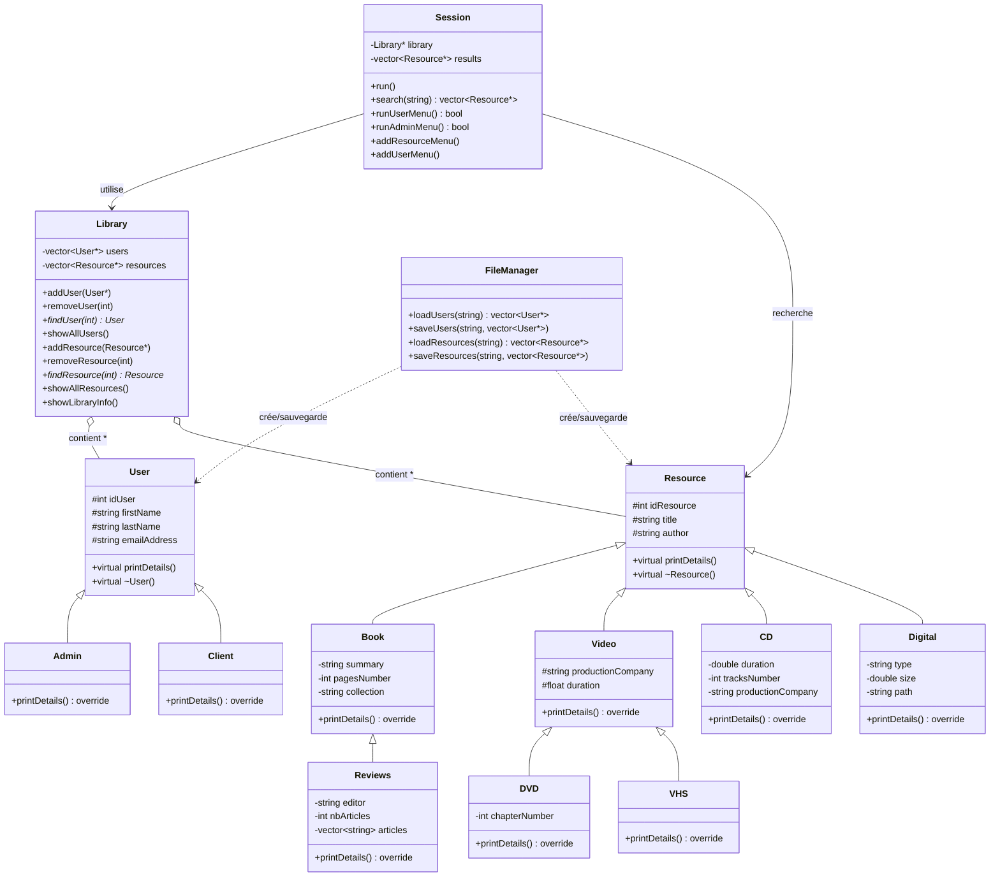

# Diagramme des Classes - Système de Gestion de Bibliothèque

## Structure du Projet

### Hiérarchie des Utilisateurs
- **User** (classe abstraite)
  - **Admin** : Utilisateur administrateur
  - **Client** : Utilisateur standard

### Hiérarchie des Ressources
- **Resource** (classe abstraite)
  - **Book** : Livres avec résumé, pages, collection
    - **Reviews** : Revues avec éditeur et articles
  - **Video** : Vidéos avec société de production et durée
    - **DVD** : DVDs avec nombre de chapitres
    - **VHS** : Cassettes VHS
  - **CD** : CDs audio avec durée et nombre de pistes
  - **Digital** : Ressources numériques avec type, taille et chemin

### Classes de Gestion
- **Library** : Gestionnaire principal des utilisateurs et ressources
- **Session** : Interface utilisateur et logique de session
- **FileManager** : Gestion de la persistance des données

### Caractéristiques du Design
- ✅ **Polymorphisme** : Méthodes virtuelles `printDetails()`
- ✅ **Encapsulation** : Membres protected/private
- ✅ **Héritage** : Hiérarchies logiques
- ✅ **Composition** : Library contient des collections de pointeurs