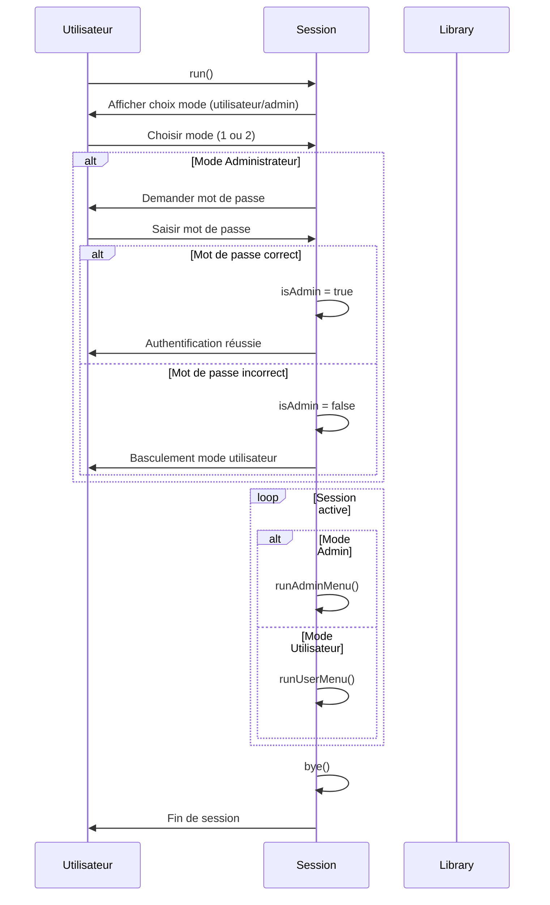
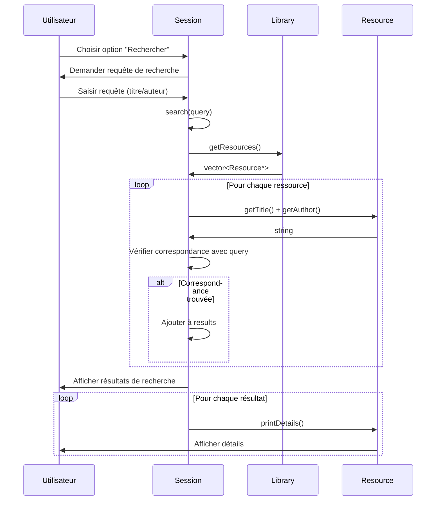
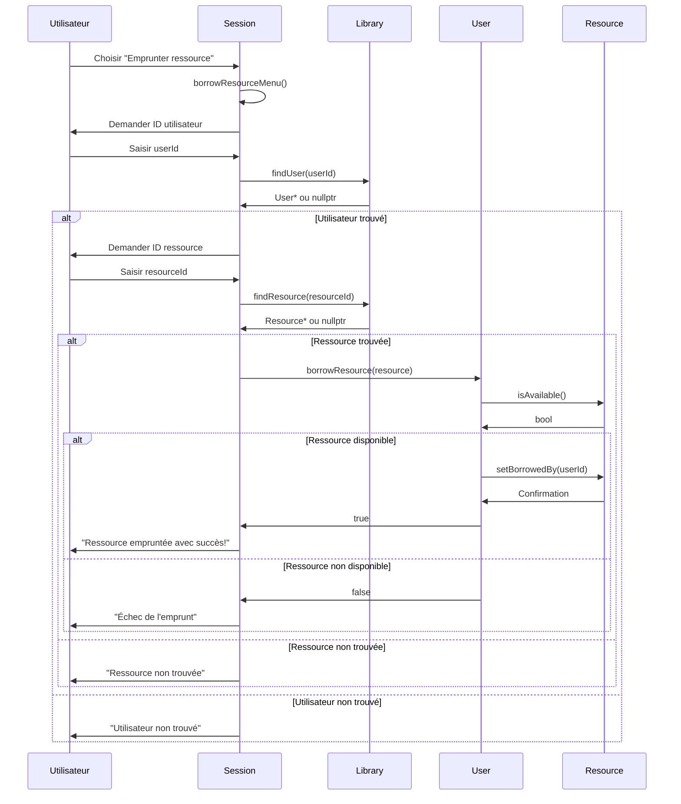
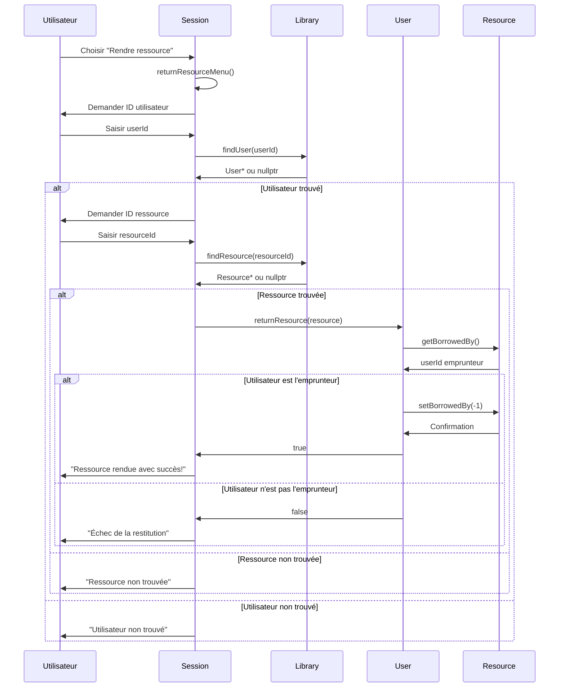
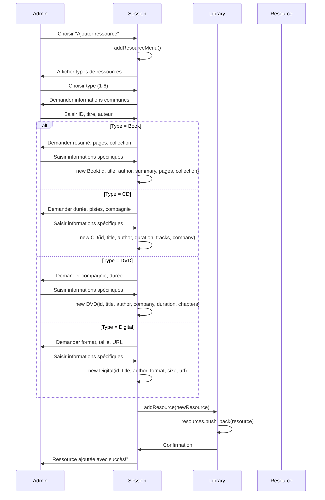
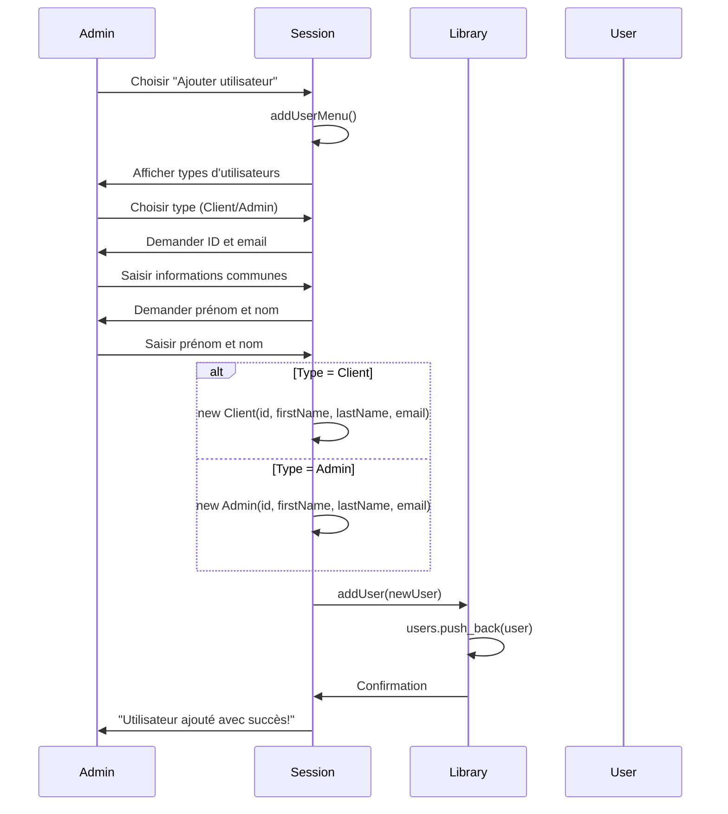
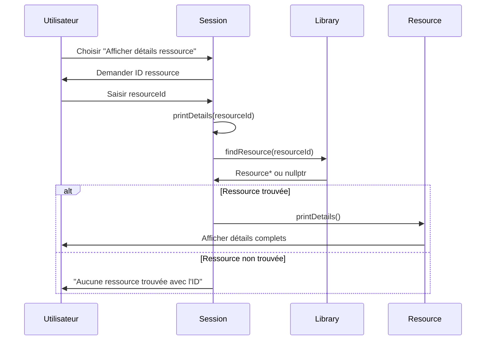
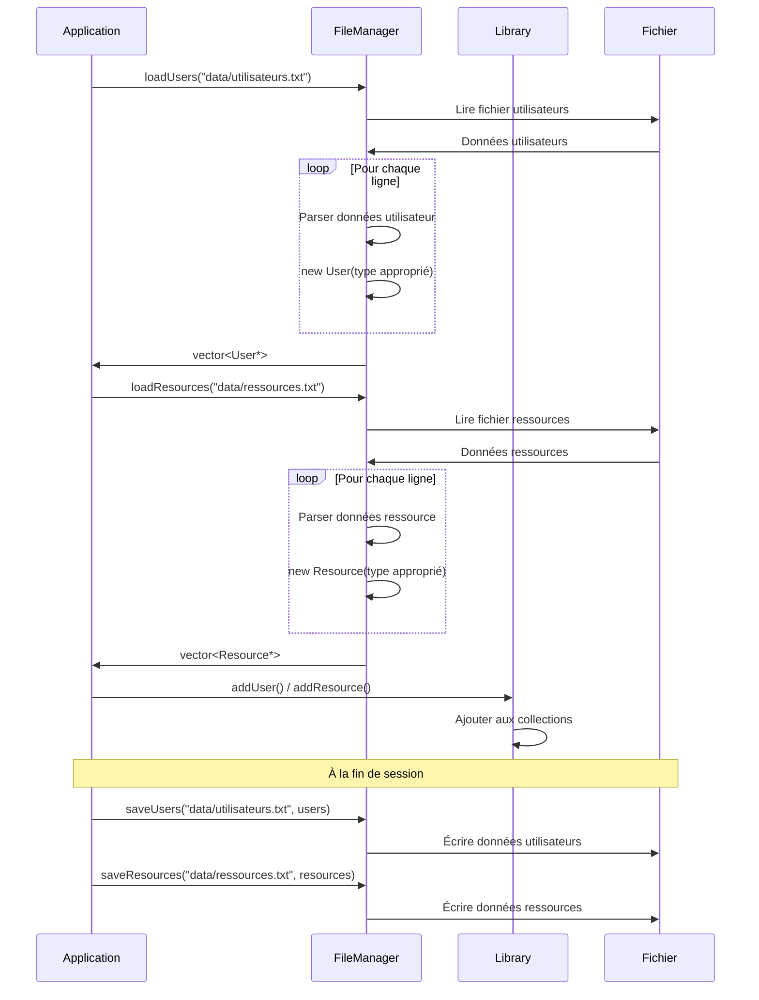

# Diagrammes de Séquences - Système de Gestion de Bibliothèque

## 1. Authentification et Démarrage de Session

## 2. Recherche de Ressources

## 3. Emprunt de Ressource (Mode Utilisateur)

## 4. Retour de Ressource

## 5. Ajout de Ressource (Mode Admin)

## 6. Ajout d'Utilisateur (Mode Admin)

## 7. Consultation des Détails d'une Ressource

## 8. Sauvegarde/Chargement de Données

## Cas d'Utilisation Identifiés

### Utilisateur Standard (Client)
1. **Authentification** - Se connecter au système
2. **Recherche** - Rechercher des ressources par titre/auteur
3. **Consultation** - Voir les détails d'une ressource
4. **Emprunt** - Emprunter une ressource disponible
5. **Retour** - Rendre une ressource empruntée
6. **Visualisation** - Voir toutes les ressources disponibles

### Administrateur
7. **Gestion des ressources** - Ajouter/supprimer des ressources
8. **Gestion des utilisateurs** - Ajouter/supprimer des utilisateurs
9. **Consultation avancée** - Voir toutes les informations de la bibliothèque
10. **Sauvegarde** - Sauvegarder les données (implicite via FileManager)

### Système
11. **Persistance** - Charger/sauvegarder les données depuis/vers les fichiers
12. **Validation** - Vérifier la disponibilité des ressources
13. **Gestion d'état** - Suivre les emprunts en cours